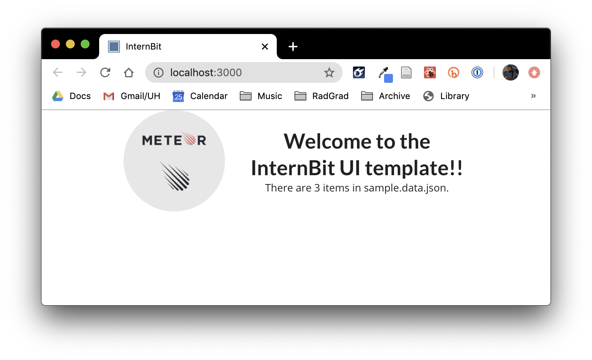

# InternBit 

This repo contains the static site for InternBit. It is based on https://github.com/csdl/csdl
.github.io.

  * The "gh-pages" branch contains the rendered HTML.
  * The "src" branch contains the source files.
  
## Table of contents
  * [Installation](#installation)
  * [Deploying the Site](#deploying-the-site)
  * [Scripts](#scripts)
  * [Scrapers](#scrapers)

## Installation

To install the system, first [install NPM](https://www.npmjs.com/get-npm).

Second, download your newly created repository to your computer.

Third, type ``npm install `` to download the correct libraries. The repo is split up in the
 following way:
 - scraper: contains all the scrapers and scraped data 
 - src: the actual static site

Each of the folder has its own ``package.json`` so cd into the correct directory.

```

C:\Users\jenna\Documents\GitHub\RadGrad\internbit\src>npm install
npm WARN optional SKIPPING OPTIONAL DEPENDENCY: fsevents@2.1.2 (node_modules\fsevents):
npm WARN notsup SKIPPING OPTIONAL DEPENDENCY: Unsupported platform for fsevents@2.1.2: wanted {"os":"darwin","arch":"any"} (current: {"os":"win32","arch":"x64"})
npm WARN optional SKIPPING OPTIONAL DEPENDENCY: fsevents@1.2.12 (node_modules\webpack-dev-server\node_modules\fsevents):
npm WARN notsup SKIPPING OPTIONAL DEPENDENCY: Unsupported platform for fsevents@1.2.12: wanted {"os":"darwin","arch":"any"} (current: {"os":"win32","arch":"x64"})
npm WARN optional SKIPPING OPTIONAL DEPENDENCY: fsevents@1.2.12 (node_modules\watchpack\node_modules\fsevents):
npm WARN notsup SKIPPING OPTIONAL DEPENDENCY: Unsupported platform for fsevents@1.2.12: wanted {"os":"darwin","arch":"any"} (current: {"os":"win32","arch":"x64"})
npm WARN optional SKIPPING OPTIONAL DEPENDENCY: fsevents@1.2.12 (node_modules\jest-haste-map\node_modules\fsevents):
npm WARN notsup SKIPPING OPTIONAL DEPENDENCY: Unsupported platform for fsevents@1.2.12: wanted {"os":"darwin","arch":"any"} (current: {"os":"win32","arch":"x64"})

audited 2053 packages in 12.056s
found 4978 vulnerabilities (4971 low, 7 high)
  run `npm audit fix` to fix them, or `npm audit` for details

```


If all goes as planned, you should now be able to run `npm start` to view the system in your browser at http://localhost:3000/:

```
$npm start

Compiled successfully!

You can now view src in the browser.

  Local:            http://localhost:3000
  On Your Network:  http://10.0.1.21:3000

Note that the development build is not optimized.
To create a production build, use npm run build.
```

Here is what the running system should look like:




## Deploying the site

To deploy the site, invoke `npm run deploy`. For example:

```
npm run deploy

> src@0.1.0 predeploy /Users/philipjohnson/github/radgrad/internbit-ui-template/src
> npm run build


> src@0.1.0 build /Users/philipjohnson/github/radgrad/internbit-ui-template/src
> react-scripts build

Creating an optimized production build...
Compiled successfully.

File sizes after gzip:

  95.63 KB          build/static/css/2.7db008ac.chunk.css
  60.12 KB (+14 B)  build/static/js/2.2a7dfe1b.chunk.js
  768 B             build/static/js/runtime-main.cf30d0f8.js
  605 B (+68 B)     build/static/js/main.cebf140d.chunk.js
  217 B             build/static/css/main.467e710e.chunk.css

The project was built assuming it is hosted at ./.
You can control this with the homepage field in your package.json.

The build folder is ready to be deployed.

Find out more about deployment here:

  bit.ly/CRA-deploy


> src@0.1.0 deploy /Users/philipjohnson/github/radgrad/internbit-ui-template/src
> gh-pages -d build

Published
```

When the system is published, it will be available under https://radgrad.github.io. So, for
 example, if the repository is named "internbit", then you will be able to see it at
  https://radgrad.github.io/internbit.

If the script fails with an authentication error, the simplest solution I've found is to run `git push origin src` on the command line. That will prompt you for your username and password and cache those values for a while so that the script will now succeed.

**Important Note**: `npm run deploy` only commits and pushes the "master" branch of the repository, which contains the rendered version of the site. It does NOT commit the "src" branch of the repository. So, make sure that you push your changes to the src branch to GitHub as well using your git client of choice.

## Scripts
Located in package.json under the ``scraper`` directory. Use them to scrape the website. More
 info on how
 found in
 [Scrapers
](#scrapers) section below. 

```javascript
  "scripts": {
    "statistics": "node src/statistics.js",
    "internships": "node scrapers/internships.js",
    "simply": "node scrapers/simplyHired.js",
    "zip": "node scrapers/zipRecruiter.js",
    "idealist": "node scrapers/idealist.js",
    "indeed": "node scrapers/indeed.js",
    "monster": "node scrapers/monster.js",
    "linkedin": "node scrapers/linkedin.js",
    "single-parse": "node scrapers/single_parser.js",
    "youtern": "node scrapers/Youtern.js",
    "cool": "node scrapers/Cooworks.js",
    "stackoverflow": "node scrapers/stackoverflow.js",
    "glassdoor": "node scrapers/Glassdoor.js",
    "ihire": "node scrapers/iHireTechnology.js",
    "angellist": "node scrapers/angellist.js",
    "multi-parse": "node scrapers/multi_parser.js && node src/statistics.js"
  },
```

**Statistics:** ```npm run statistics``` 
This script provides relevant information about each site that was scraped. The numbers
 correspond to how many fields were **not** empty. 
 
```json
{
  "site": "Total",
  "lastScraped": "2020-09-04T00:45:30.335Z",
  "entries": 3286,
  "position": 3284,
  "company": 3284,
  "contact": 417,
  "location": 3286,
  "posted": 2772,
  "due": 93,
  "start": 98,
  "end": 0,
  "compensation": 811,
  "qualifications": 1295,
  "skills": 3240,
  "description": 3284
}
``` 
  
You have to manually add the newly listed site
  so its statistics are generated.   
```javascript
const zipData = readFile('./data/parsed/ziprecruiter.parsed.data.json');
const simplyData = readFile('./data/parsed/simplyhired.parsed.data.json');

let data = [];
data = _.concat(zipData, simplyData);
data = _.concat(data, cheggData);

statistics.push(
    getStatistics('Glassdoor', glassData),
    getStatistics('Indeed', indeedData),
    getStatistics('Total', data),
)
...
```
 

**Multi-Parse:** ```npm run multi-parse```

This script goes through all canonical data and uses NLP/Regex to extract relevant information
 about skills, qualifications, compensation, and start/end date for each internship posting. It also ensures that each file is the correct format so it does not break the site. Once it is
  done, the new files are saved under ```/src/src/data``` and statistics are updated. 
  **The files generated here are used by the static site.**

**Single-Parse:** ```npm run single-parse```
Extracts relevant information about skills, qualifications, compensation, and start/end date for
 a single file. At the moment, you must change the variables to parse the file you want:
 ```jsx harmony
const rawData = fs.readFileSync('./data/canonical/angellist.canonical.data.json');
const text = JSON.parse(rawData);
...
fs.writeFile('data/parsed/angellist.parsed.data.json',
    JSON.stringify(text, null, 4), 'utf-8',
    err => (err ? console.log('\nData not written!', err) :
        console.log('\nData successfully written!')));
```


## Scrapers
The scrapers for each site are listed under the ```/scrapers``` directory. All the data are
 stored under ```/scrapers/data/canonical``` and **not** upload to the site.

The following scrapers require a search query parameter (Eg. ```npm run simply computer science```): 
- SimplyHired
- Internships (Chegg)
- Monsters.com
- Idealist

The following scrapers do not require any parameters:
- Glassdoor
- Stackoverflow
- LinkedIn
- YouTern
- iHireTechnology
- Indeed

The following scrapers require login in parameters:
- AngelList


**SimplyHired:** 
 
 ```npm run simply [search query]```. For example:  ``npm run simply computer
 science``. Result from the run is available at: [simplyHiredData.json](https://github.com/radgrad/internbit/blob/master/src/scrapers/data/canonical/simplyHired.canonical.data.json)
 * Current filters:
    * Date Relevance: 10 days
    * Any distance
 
**Idealist:**

```npm run idealist [search query]```. Result from the run is available at: [simplyHiredData.json](https://github.com/radgrad/internbit/blob/master/src/scrapers/data/canonical/idealist.canonical.data.json)
        
**Internships (Chegg):** 

```npm run internships [search query]```.  Result from the run is available
 at: [internships.data.json](https://github.com/radgrad/internbit/blob/master/src/scrapers/data/canonical/internships.canonical.data.json)
   * **At the moment it doesn't work because of the reCATPCHA issue**
   * Unfortunately, [internships.com](https://www.internships.com/app/search) uses infinite scroll. Each internship
       doesn't have an associated URL link (like zipRecruiter) to its page so I have to click back and
        forth between the the listing and the main search page so it is slow. It takes roughly ~20
         minutes to scrape 250 listings.
   * Current filters:
      * Hawaii
      * Sorted by Date

**Monsters.com:**

```npm run monster [search query]```. For example:  ``npm run monster computer
 science intern`` Result from the run is available at: [monster.data.json](https://github.com/radgrad/internbit/blob/master/src/scrapers/data/canonical/monster.canonical.data.json)
*  Current filters:
   *  Only show jobs posted within last 30 days

**LinkedIn:** 

Run ```npm run linkedin``` to start the script.
           Result from the run is available at: [linkedin.data.json](https://github.com/radgrad/internbit/blob/master/src/scrapers/data/canonical/linkedin.canonical.data.json)         
 * Filters:
    * Only shows internships listed within last 30 days
    * Only show those listed as internships
    * Sorted by last posted

**StackOverflow:** 

Run ```npm run stackoverflow``` to start the script.
Result from the run is available at: [stackoverflow.data.json](https://github.com/radgrad/internbit/blob/master/src/scrapers/data/canonical/stackoverflow.canonical.data.json)
                  
**GlassDoor:**

Run ```npm run glassdoor``` to start the script. Result from the run is available at: [stackoverflow
.data.json](https://github.com/radgrad/internbit/blob/master/src/scrapers/data/canonical/glassdoor.canonical.data.json)


## License

MIT.  See [license](LICENSE.md)
