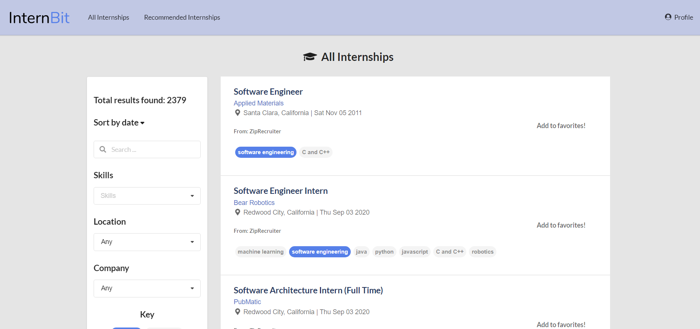

# InternBit UI Template

This repo supports the creation of a static site for building mockups of the InternBit UI. It is based on https://github.com/csdl/csdl.github.io.

  * The "gh-pages" branch contains the rendered HTML.
  * The "src" branch contains the source files.

## Installation

To install the system, first [install NPM](https://www.npmjs.com/get-npm).

Second, use the "Use the template" button to create your own copy of the repository. Call it something like "internbit-ui-au" where "au" are your initials.

Third, download your newly created repository to your computer.0

Fourth, cd into the src/ directory of the "src" branch, and type `npm install` to download the libraries necessary to build and deploy the system:

```
$ npm install

> fsevents@1.2.12 install /Users/philipjohnson/github/csdl/csdl.github.io/src/node_modules/jest-haste-map/node_modules/fsevents
> node-gyp rebuild

  SOLINK_MODULE(target) Release/.node
  CXX(target) Release/obj.target/fse/fsevents.o
  SOLINK_MODULE(target) Release/fse.node

  :
  :

Binary found at /Users/philipjohnson/github/csdl/csdl.github.io/src/node_modules/node-sass/vendor/darwin-x64-64/binding.node
Testing binary
Binary is fine
added 2044 packages from 892 contributors and audited 932326 packages in 62.816s
found 0 vulnerabilities
```

If all goes as planned, you should now be able to run `npm start` to view the system in your browser at http://localhost:3000/:

```
$npm start

Compiled successfully!

You can now view src in the browser.

  Local:            http://localhost:3000
  On Your Network:  http://10.0.1.21:3000

Note that the development build is not optimized.
To create a production build, use npm run build.
```

Here is what the running system should look like:




## Deploying the site

To deploy the site, invoke `npm run deploy`. For example:

```
npm run deploy

> src@0.1.0 predeploy /Users/philipjohnson/github/radgrad/internbit-ui-template/src
> npm run build


> src@0.1.0 build /Users/philipjohnson/github/radgrad/internbit-ui-template/src
> react-scripts build

Creating an optimized production build...
Compiled successfully.

File sizes after gzip:

  95.63 KB          build/static/css/2.7db008ac.chunk.css
  60.12 KB (+14 B)  build/static/js/2.2a7dfe1b.chunk.js
  768 B             build/static/js/runtime-main.cf30d0f8.js
  605 B (+68 B)     build/static/js/main.cebf140d.chunk.js
  217 B             build/static/css/main.467e710e.chunk.css

The project was built assuming it is hosted at ./.
You can control this with the homepage field in your package.json.

The build folder is ready to be deployed.

Find out more about deployment here:

  bit.ly/CRA-deploy


> src@0.1.0 deploy /Users/philipjohnson/github/radgrad/internbit-ui-template/src
> gh-pages -d build

Published
```

When the system is published, it will be available under https://radgrad.github.io. So, for example, if the repository is named "internbit-ui-template", then you will be able to see it at https://radgrad.github.io/internbit-ui-template.

If the script fails with an authentication error, the simplest solution I've found is to run `git push origin src` on the command line. That will prompt you for your username and password and cache those values for a while so that the script will now succeed.

**Important Note**: `npm run deploy` only commits and pushes the "master" branch of the repository, which contains the rendered version of the site. It does NOT commit the "src" branch of the repository. So, make sure that you push your changes to the src branch to GitHub as well using your git client of choice.


## License

MIT.  See [license](LICENSE.md)
